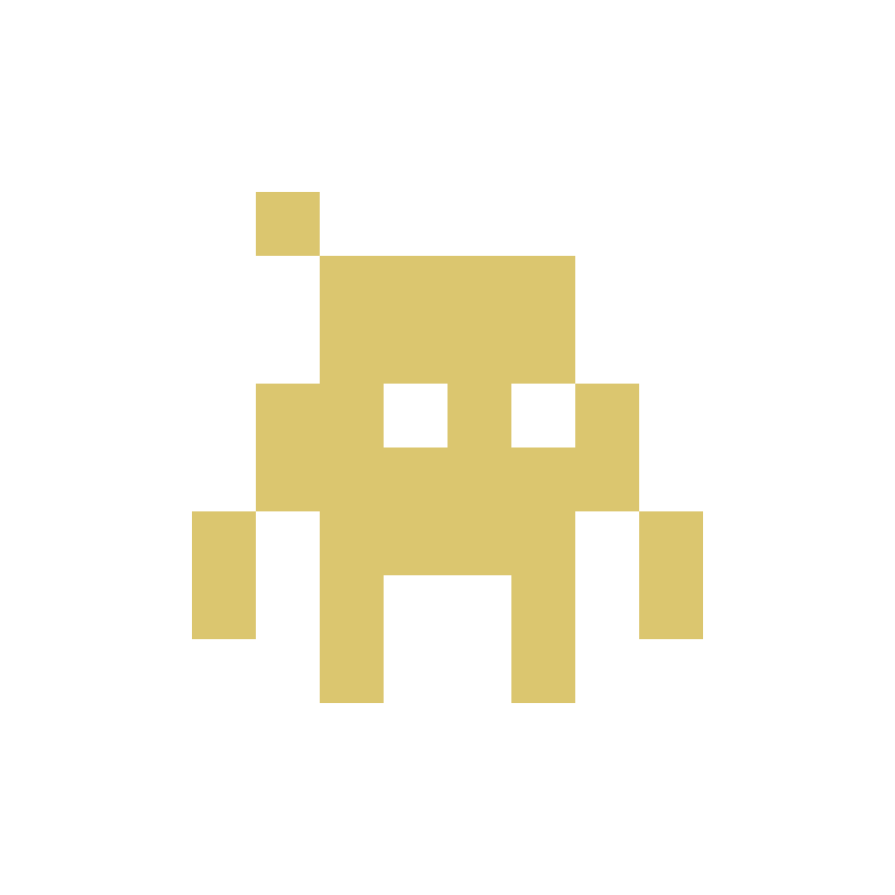

# Luvus

<div align="center">



**Mission control for your AI coding agents.**

[](https://crates.io/crates/luvus)
[](https://github.com/RizRiyz/luvus/actions/workflows/ci.yml)
[](https://luvus.dev/docs/)


**[Website](https://luvus.dev)** · **[Documentation](https://luvus.dev/docs/)** · **[Releases](https://github.com/RizRiyz/luvus/releases)**

<br />

<a href="assets/video.mp4"></a>

</div>

## Features

- **Persistent workspaces:** Open, rename, pin, and switch projects. A background
  server keeps tabs, panes, layouts, terminal state, and named sessions alive.
- **Complete pane and tab control:** Split, resize, zoom, move, name, focus, run,
  inspect, close, reorder, and swap with the mouse, TUI, or CLI.
- **Agent awareness:** Detect supported agents automatically and show blocked,
  working, done, or idle state with session titles, tokens, cost, context use,
  and optional sound alerts.
- **Agent workflows:** Start, name, message, inspect, wait for, resume, and send
  keys to agents. Fork Claude, Grok, Codex, Pi, and OMP sessions with their
  context intact.
- **Files and code:** Browse a Git-aware file tree, inspect files and changes,
  reveal paths, and open files in a pane, tab, preview, or external editor.
- **Git and GitHub:** View status, branches, commits, contributors, pull
  requests, issues, and repository activity without leaving Luvus.
- **Worktrees and orchestration:** Create worktrees, coordinate dependent tasks,
  reserve file paths, assign agents, run quality gates, and merge completed work.
- **Remote and multi-client use:** Attach over SSH, connect several clients with
  independent viewport sizes, and use the compact switcher on narrow screens.
- **Terminal tools:** Configure per-pane Scrollback Memory, search across pane
  history, use copy mode, click detected links, and run full-screen terminal apps.
- **Extensible surfaces:** Install modules with actions, events, settings,
  startup hooks, panes, sidebar docks, and Top or Bottom Luvus Bar widgets.
- **Universal Harness Protocol:** Build harnesses and orchestrators on the
  single versioned UHP 1.0 method registry, with owner-only local IPC,
  snapshots, event streams, exact input, and semantic waits.
- **Custom interface:** Move and resize two sidebars, remap keys and the prefix,
  use presets, select from 8 languages, and install composable local or
  community themes.
- **Cross-platform delivery:** Install on macOS, Linux, or Windows, migrate from
  previous releases, update with `luvus update`, and inspect the environment with
  `luvus doctor`.

## Install

```sh
# macOS and Linux
curl -fsSL https://luvus.dev/install.sh | sh

# Homebrew
brew install RizRiyz/luvus/luvus
```

```powershell
# Windows PowerShell
irm https://luvus.dev/install.ps1 | iex
```

## Quick start

```bash
luvus          # launch or reattach to your session
luvus doctor   # check your setup: git, gh, ssh
luvus update   # check for and install a newer release
```

Run Luvus in a project, split a pane, and start an agent. Luvus detects supported
agents automatically.

**macOS:** Disable *Select the previous input source* under **System Settings →
Keyboard → Keyboard Shortcuts → Input Sources** to free `Ctrl+Space`.

## Supported agents

| Agent | Live status | Session resume | Precise events (hook) |
|---|:---:|:---:|:---:|
| Claude Code | ✓ | ✓ | ✓ |
| GitHub Copilot CLI | ✓ | ✓ | ✓ |
| Codex | ✓ | ✓ | ✓ |
| Antigravity CLI | ✓ | ✓ | session only |
| opencode | ✓ | ✓ | ✓ |
| Kimi | ✓ | ✓ | ✓ |
| Grok | ✓ | ✓ | ✓ |
| Hermes CLI | ✓ | ✓ with integration | session only |
| Pi | ✓ | ✓ | No |
| Oh My Pi (omp) | ✓ | ✓ | ✓ |
| Muse Code | ✓ | ✓ | No |
| Fx | ✓ | ✓ | No |
| Cursor | ✓ | resume command | No |
| Gemini · Aider · Amp · Droid · Qwen · Kiro | ✓ | No | No |

Live status needs no agent integration. See the
[documentation](https://luvus.dev/docs/) for setup, keybindings, modules, and
the complete CLI and API reference.

## Development

Read [CONTRIBUTING.md](CONTRIBUTING.md) for setup, tests, and pull request
requirements. Native agent contributors should also read
[Adding Agent Support](https://luvus.dev/docs/extend/adding-agent-support/).
Report vulnerabilities through [SECURITY.md](SECURITY.md).

## License

[Apache License 2.0](LICENSE).
